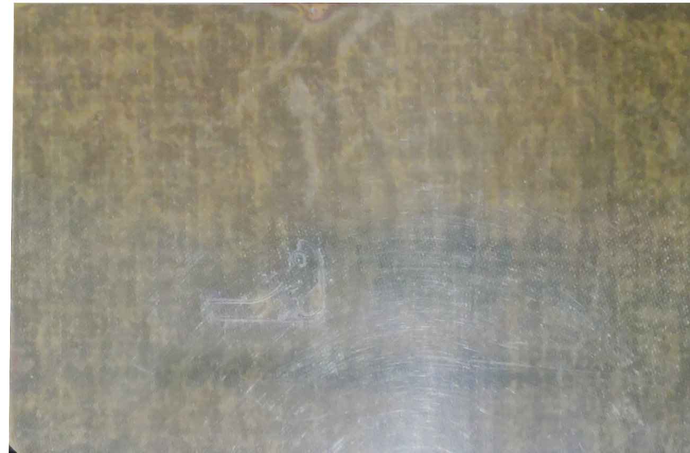

# R2X 14T Service Manual
(R2X 14T is a mod by Jake Gustafson for the MakerBot Replicator 2X)

See https://github.com/poikilos/r2x_14t for updates.
- Open md files using the web interface above for best results (Otherwise, use a printed version or view the file in Notepad++, Geany, or a Markdown editor).


## Firmware
All branches are from the Poikilos fork: <https://github.com/poikilos/Marlin>, but only on the following branch:
- Marlin: bugfix-2.0.x-replicator2x (based on the bugfix-2.0.x branch)
  - Made via:
```
git clone https://github.com/poikilos/Marlin
cd Marlin
git checkout bugfix-2.0.x
git branch bugfix-2.0.x-replicator2x
git checkout bugfix-2.0.x-replicator2x
```
- Marlin-bugfix-2.0.x: kept for backup but unchanged
- The only changes are to Configuration.h, Configuration_adv.h, and platformio.ini.
  - For improvements over the factory design (including a different E steps per mm setting) see [contributing.md](../contributing.md#making-sneaky-firmware-overextrusion-optional).


## Usage

The display (BIGTREETECH TFT24) has two modes: Marlin mode (a text mode) and Touch mode. Marlin mode has a complete set of features enabled in the firmware, and may be necessary for troubleshooting steps. Change the mode by pressing and holding the dial for 3 seconds until the selection appears then tap the desired mode. In Marlin mode, move the cursor or change the value by turning the dial and press the dial as a button to enter a menu or value.

If you change the nozzles, ensure you tighten them while hot. If the nozzle differs in entire length, you must Run the Z Probe Offset wizard. It will take a while to heat up for the "Homing XYZ" step. If you wait too long between moves when adjusting the offset, it will time out and you must start again. For other problems, see "Troubleshooting".


## Troubleshooting:
Issue: The z axis makes a loud motor sound and hits the top or bottom.
Solution: If the nozzles touch the bed during homing, press reset to stop the motor from turning and stuttering, you must ensure that the wires from the BLTouch to the mainboard are all operating. If the probe doesn't deploy at all before moving upward, the issue is with the brown-red-yellow bundle. Note that the z endstop is entirely ignored using firmware settings (It must be entirely ignored by the firmware for the Z Axis probe such as BLTouch to operate properly).


- Before running the wizard or performing other homing with the probe, ensure that you have the bed moved slightly upward (at least 20mm from the bottom) because the bed will try to move down regardless (to allow clearance to deploy the probe, since the printer is unaware of the z location until homing is performed).
(See [ABL offset guide including new probe Z offset wizard](https://www.youtube.com/watch?v=fN_ndWvXGBQ))

In Touch mode:
- Go to Menu, Movement, Bed Level, P Offset (ensure "ON" instead of "OFF").
- Wait for the bed and nozzle to heat up--then the touch sensor to touch the bed.
- Get a shim (such as a feeler gauge leaf) the size shown on the screen or change the value to match your shim. Otherwise, use a piece of printer paper.
- Use the up and down arrows (usually down) until the nozzle touches the shim (or there is slight drag when moving the printer paper). The small movements may be imperceptible until they get close to the shim: Press rapidly if necessary but avoid long press since that is the gesture that causes it to ask to switch to Marlin mode.
- Press Next, Save, OK.


Or, in Marlin mode:
- Go to Configuration, Advanced Settings, Probe Offsets, Z Probe Wizard (The Probe Z Offset isn't the same as that and is more difficult).

Or, in Marlin by setting "Probe Z Offset" directly:
- Movement, Auto Home
- Movement, Move Axis, Move Z, dial it to 0.0
- Go to Configuration, Advanced Settings, Probe Z Offset
  - Get a shim (such as a feeler gauge leaf) the size shown on the screen or change the value to match your shim. Otherwise, use a piece of printer paper.
  - Use the up and down arrows (usually down) until the nozzle touches the shim (or there is slight drag when moving the printer paper). The small movements may be imperceptible until they get close to the shim
  - Click the dial to confirm the value.
  - Scroll down to "Store Settings" and click the dial.

### Issue: What is the meaning of "Marlin 2.0.x-bugfix"?
Solution: We are using the bugfix branch since it has the latest fixes and Marlin releases are far apart. The bugfix branch is recommended by the hardware documentation.

### Issue: Certain parts of the bed adhere well and others do not, or the lines are separated on some parts of the bed but the first layer has no gaps on other parts.
Solutions:
- Ensure that the proper start G-code is present when slicing to utilize auto home and restore mesh before printing.
- Level the bed: In the case that The bed has changed or for some other reason the bed's surface variance has changed, or the bed's mesh is no longer saved in the emulated EEPROM, level the bed again:
  - In Marlin mode (in Main):
    - Go to Motion, Bed Leveling, Level Bed.
    - Go back to Main, then Configuration, Store Settings (you will hear 2 ominous beeps upon success).
  - In touch mode:
    - Menu, Movement, Bed Level, ABL, Start. It will take several minutes.
    - When it is complete it beeps 3 times rapidly.
    - Press OK after that when it asks to store the mesh to EEPROM.
- Replace the bed: In the case that the bed is a FilaPrint bed and 5 years old or more, replace the surface with a new FilaPrint bed surface or borosilicate glass with patterned silicone. Either type of bed will become sticky when hot and release the printed part when cool in most cases (See also: "The print adheres too well"). To potentially avoid buying a new bed surface, re-slice the model to print on a part of the bed that isn't as worn.

### Issue: The print adheres too well.
Solution: The nozzle is likely too hot or too close to the bed while printing. See bed leveling instructions under "Certain parts of the bed adhere well and others do not".

### Issue: The 3D printer doesn't work with OctoPrint or some other network 3D printing host.
Solution: Ensure that the UUID is set in the firmware settings (contact Axle Media for assistance).

### Issue: The part (center) fan doesn't come on.
Solution: Unless the fan is faulty, obstructed or disconnected, the fan should come on at the height you specified when you sliced the model and produced the g-code file. Slicer software often defaults to not enable the fan right away, as having too much part cooling during the initial layer(s) can reduce adhesion to the bed. Also, auto cooling may enabled, which sets the fan speed based on the pattern of extrusion.

### Issue: The fan becomes loud.
Solution: Contact Axle Media for a replacement fan. A 40x40x10mm fan is difficult to find online in 24V since many poor brands heavily canvas sites like Amazon. Axle Media has the fan in stock and we can try a different brand that lasts longer at no charge during a period of 1 year from date of printer delivery, guaranteed, other that stock fans which were not replaced (marked "new" and dated if replaced and guaranteed).

### Issue: The print head is very close to the part or touching it at the time printing ends.
Solution: Ensure that the slicer software inserts appropriate end g-code as provided by Axle Media or the mainboard manufacturer.

### Issue: The screen keeps saying "Paused for user".
Solution: This seems to be a firmware bug when loading or unloading filament. Press the reset button to stop the loop.

### Issue: The screen says "No printer attached!"
Solution: This is normal to appear for about 5 seconds while the screen initializes the connection to the mainboard. If the problem continues, ensure the connections from the mainboard to the screen. After that, if the error persists for more than a few seconds during startup, the screen or mainboard may have developed a fault.

### Issue: You hear groups of 3 beeps and the screen says "Printer halted".
Solution: The bed was probably just taking too long to heat. This is a safety feature but may be too sensitive. Press reset while the bed is still warm and try printing or heating the bed again.

### Issue: Overhangs are uneven, corners are blobby, the model curls up at the edges during printing, or 1-layer walls are too thick by a small amount.
Solution: The flow rate may need to be adjusted even though the extrusion has been calibrated. Even after calibrating the z steps per mm, the Teaching Tech calibration cube printed with .5 thick walls using a .4mm nozzle, so a flow rate of as low as 80% may be necessary (The height of the cube was correct [27.4 of 27.2, but that is within the error rate with a layer height of .32], so z steps per mm were not the problem). The calibration test using a 1.0mm nozzle suggests 90% is appropriate, and printing that way yielded walls very close to 1.0mm. Setting the flow for the the top and bottom layers to 100% reduces gaps.

### Issue: On startup, the screen says, "Err: MAXTEMP: E1" "PRINTER HALTED" "Please Reset"
Solution: If the bed is hot and the temperature reading is correct, the expected heating delay in the Marlin firmware must change to a calculation slightly higher than using a stopwatch. In other cases, the bed thermistor or bed thermistor connection has failed.


## Hardware Guide
- The 3D printed parts are printed in Inland PLA+ except the matte parts which are in Overture PLA Pro (190-220 C). PLA+ and PLA Pro are chemically equivalent (PLA modified with TPU, generally). However, depending on the source vegetation and processing, PLA can differ in finish and temperature range. Higher temperature PLA+ is used for the cooler.
- The Zheng Shuo AC power switch is rated for 10A since the stock 24V AC adapter is rated for 9.16. The switch was added since the btt mainboard doesn't have a power switch (It does have a software-driven power supply controller which could be connected to a relay).
  - It included (2) #6 x 3/8" panhead sheet metal screws to secure the front panel.
- The USB port extender is fastened with #4-40 bolts. The  original bolts were replaced with countersunk ones.
- The 3D printed mount for the TFT35 screen is attached to the stock metal LCD backplate using (2) #4 sheet metal screws going into the plastic tap holes, each with a washer and lock washer.
  - The 3D printed bezel is attached using (4) slotted countersunk #4 x 7/16 sheet metal screws.
- To accommodate the unusual heater cartridges from the Replicator 2X, the screw heads are filed to a smaller diameter, the washers are filed down on one side, and the heater cartridge shafts in the heater blocks are drilled out larger. If a heater cartridge must be replaced, switching to a standard heater block with standard hardware and no modifications is preferable. When the type of heater cartridge, heater block, or insulation changes, perform PID tuning again and place the new values in the firmware.
  - Performing it on the bed for 60C resulted in temperature shutdowns, so tried cooling to 30C then running again at 105 (; Marlin-20-specific G-code is from https://all3dp.com/2/3d-printer-pid-tuning/):
```
M303EBED S105 C6
```
  result:
```
  #define DEFAULT_bedKp 33.3357
  #define DEFAULT_bedKi 4.0417
  #define DEFAULT_bedKd 68.7382
```
  formerly (for 60C):
```
  #define DEFAULT_bedKp 56.49
  #define DEFAULT_bedKi 2.49
  #define DEFAULT_bedKd 853.97
```
- All fans are 24V 4010 fans (40mm x 40mm x 10mm). The only quieter fan I found is a 12V SUNON MagLev fan. Using (4) 24V to 12V buck converters, using that fan model would be possible.
- The fans on the hotend assembly must point toward the heatsink (the label points in the direction of airflow).
  - The 3D printed parts are available from Axle Media and are planned to be posted at https://thingiverse.com/poikilos.
  - The extruder motor fans are attached to the 3D printed fan mount using (8) M3x12 screws.
    - The part makes the custom cooler stick out as far as the stock cooling assembly and fans would have, but in this case the fans go on top of that layer.
  - The nozzle cooling part with the extruder fan grill is attached using the (4) stock M3x55 partially-threaded screws. Since it hooks around the bottom, it must be slid upward from the bottom to be installed.
    - The fan attaches to it using (4) M3x20 screws. It includes (4) custom spacers which are not necessary but help create even pressure and possibly reducing loosening. The fan must be wired to the FAN0 port since that is the only variable-speed fan port on the BTT SKR V1.4 Turbo.
- The mainboard fan is attached using (4) #6 screws x 1/2" screws from the outside.
  - The mainboard fan is connected to the last fan port using a custom cable that includes a buck converter (LM2596 DC-DC HW-411). The buck converter is tuned to provide a reasonable level of speed and lower noise than when running at 24V (it is one of the loudest fans tested at that voltage). The fastest available fan was used since it is used at less than 24V: JH DC brushless fan. It still makes a slight low whistling noise that can be dampened by placing sound absorbers under the 3D printer. The fan can be replaced with a quieter fan if necessary.
- The air scrubber requires a 12V DC adapter (the plug size is "5.5mm x 2.5mm"--due to the large 2.5mm pin size, not all 12V adapters will fit, but a pin size adapter could be made or used--The more common pin/inner diameter (I.D.) is 2.1mm).


## Consumables Guide
- The Air Scrubber requires a 3M Organic Vapor Cartridge (such as 6001PB1-1).
- When using PLA+, note that different formulations have different properties. The eSUN, Inland, and LD brands are the same filament; Matterhackers "Natural PLA" is also the same (https://www.reddit.com/r/3Dprinting/comments/4ytnet/are_inland_esun_and_matterhackers_pla_all_rebadges/). This filament (by any of the brands in this list) seems to adhere to the bed and flow the best (Overture PLA Pro doesn't extrude easily; 3D Printlife Pro PLA has an inconsistent flow rate due to width variance or other reasons).


## Stock Hardware
- A fully-enclosed chamber is not necessary since PLA and PLA+ and other plastics require significant cooling. Attach the hood and door (and any panels not attached) for printing with ABS.


## Maintenance Guide
### Replacing a Nozzle
- To ensure the nozzle is a type that can be inserted enough to form a tight fit against the throat, ensure that the new nozzle has slightly more than 5.9mm from the threaded end to where the non-insertable part begins. Try to get a nozzle that is in the style of the installed one. If the nozzle is not exactly 12.5mm in its entirety, you must perform the Z Probe Offset wizard after installing it. Furthermore, always running it after changing nozzles ensures accuracy of the first layer.
- First perform a cold pull: Heat the nozzle to the maximum temperature of the filament for 5 minutes, reduce the temperature to near the glass transition point or 150 C, press the red filament release lever, and forcibly remove the filament.
- Always stabilize the heater block while turning the nozzle. Avoid damaging the thermistor wires: The right one comes from the front of the right heater block and the left one comes from the rear of the left heater block.
- The nozzle will be very hot, so avoid injury or fire by obtaining a deep 7mm socket for a socket wrench or otherwise ensuring that the hotend will be captured safely while it cools. With the nozzle at 150 C, remove it and install the new one. Ensure the nozzle is hot while tightening so that it doesn't become loose under heat.


## Materials Guide
eSUN and Inland PLA+ are the same material by different brands (so is MatterHackers PLA-N--See [a related thread on Reddit](https://www.reddit.com/r/3Dprinting/comments/4ytnet/are_inland_esun_and_matterhackers_pla_all_rebadges/)). They are preferable over matte filaments, since:
- Matte filaments do not adhere to the bed relatively well.
- Paint does not adhere as relatively well to matte filaments.

## Disassembly Guide

### Disassemble the Hotend Assembly
- Before continuing, if you must remove the motors from the cooling block, first unload or remove filament.
- Remove the center fan (part fan) entirely. Remove the two long 3mm screws underneath it as well as the two additional long screws outside of it at the same height.
- To replace any wired components complete steps above then, cut the zip tie(s) holding the wiring harness to the back motor brace. For certain components, unwrapping a few inches of the large woven sheath will be enough. For other components, the wire runs all the way to the mainboard.
- To remove the motors, complete steps above then rock & slide the force-fit plastic back motor brace straight back (it slides into a groove at the bottom tightly when assembled).
- To remove the cooler (motor mount block and heatsink assembly) and other components, you must at least complete the step above to remove the back motor brace. Then you must remove the two 3mm screws from the bottom of the cooler.
- To remove the Copperhead throats, first obtain Boron Nitride paste (a high temperature thermal paste recommended by Copperhead). Remove the large vertical screw from the thin mounting bar on the bottom.

### Disassemble the Mainboard Compartment Parts
- Unload filament then disassemble the hotend, or place 2x4's or similar devices under the printer's sides so you can turn the printer upside-down without damaging the hotend assembly.
- Remove the filament spools from the back, ensuring that you secure the end of the filament to a hole on the side of the spool to prevent tangling.
- Turn the printer upside-down, ensuring that that hotend assembly doesn't touch the surface.
- Remove the 4 screws that secure the mainboard compartment lid.
- Slowly remove the mainboard compartment lid and unplug the mainboard fan (FAN3) from the mainboard before the wire becomes taught to avoid damaging it.

## Assembly Guide

### Hotend Assembly Guide
- Screw the motor mount block (cold block) to the carriage using (2) M3 screws from the bottom.
- The center fan (part fan) must be installed last because 2 of the (4) stock M3x55 partially-threaded screws are under it. When assembling, add the 3rd screw first since it is slotted at the far end:
 - push the screw all the way through the assembly
 - push the far end of the screw over to the right
 - thread it partly into the motor
 - move the motors to align them with the other 3 holes
- Add and partially screw the other 3 screws in any order into the motors.
- Tighten all 4 screws in any order, preferably outside (1st and 4th) first.
- Add the back motor bracket that includes a wire guide. Zip tie the wiring harness to the wire guide.


## First-time setup
Perform the following steps on the 3D printer's screen after moving it:
- Auto Home
- Change the Z Probe Offset (it changes in realtime in Marlin 2.0.x-bugfix) until the nozzle touches a 0.1mm feeler gauge (or piece of common U.S. printer paper with slight resistance to sliding).
- Level Bed
- Control, Store Memory (or in Pronterface via USB, or in touch menu's terminal, run M500) to save the mesh to EEPROM.

The settings/cura directory contains documentation and exported files ready for import.

The csv file "settings/cura/profiles/Fast ABS .2.csv" contains the same information as "settings/cura/profiles/4.9.1/Fast ABS .2.curaprofile" but works with the csv profiles plugin from Cura so the file should work on any version of Cura.
- To get Cura plugins, click "Marketplace" near the top right in Cura.

See a detailed description of material and printer settings in the settings directory.
- For Cura see [documentation/settings/cura/R2X-14T-Cura_Setup.md](settings/cura/R2X-14T-Cura_Setup.md). There is no feature to import or export printer instances in Cura, so the document outlines all of the settings you would enter when creating a new "Custom FFF Printer" in Cura.
- For PrusaSlicer see [documentation/settings/PrusaSlicer/R2X-14T-PrusaSlicer_Setup.md](settings/PrusaSlicer/R2X-14T-PrusaSlicer_Setup.md).
- For customizing PrusaSlicer start & end gcode, see "PrusaSlicer" below.

### PrusaSlicer
- Copy the config/PrusaSlicer directory to %APPDATA% (or .config on Linux)
- Install PrusaSlicer (The version should match the one in the `version =` line in the included [config/PrusaSlicer/PrusaSlicer.ini](../config/PrusaSlicer/PrusaSlicer.ini).
- Getting support: Most Slic3r tutorials apply to PrusaSlicer. It is a fork of Slic3r, but PrusaSlicer is maintained and released more frequently. Both have strong community support, and PrusaSlicer has corporate support. Though direct assistance may only be available for Prusa 3D printer owners, the [PrusaSlicer GitHub repo](https://github.com/prusa3d/PrusaSlicer) is active. Reporting issues on the Issues section after searching it and ensuring the issue doesn't already exist there is the proper way to report bugs.
- Customizing start & end g-code: [Slic3r placeholders](https://github.com/prusa3d/PrusaSlicer/wiki/Slic3r-placeholders-(a-copy-of-the-mauk.cc-page))


### Cura
If you only need one printer, rename your `%APPDATA%/cura` directory then copy the `config/cura` directory to `%APPDATA%/` (or to `.config/` on Linux)

Otherwise, follow the instructions in [documentation/settings/cura/R2X-14T-Cura_Setup.md](settings/cura/R2X-14T-Cura_Setup.md) to import the profiles and add a custom printer.

## Troubleshooting Print Quality
Software is usually the solution to print quality, and the techniques vary and improve constantly. Therefore, search for the following symptoms by name if you have them:
- ringing or ghosting
  - Ensure you use a dampening (but not springy) set of feet, otherwise explore software or firmware solutions including acceleration calibration.
  - If the problem persists, the higher timing accuracy of Klipper may be necessary. Klipper has a minimal firmware and the server actually sends the step commands directly. Requiring Klipper isn't expected because it is more of a benefit to 8-bit boards since that is more of a contrast to a PC than is a high-performance board such as BTT SKR V1.4 Turbo.
- layer shifting
- poor layer adhesion

Additional issues that are more clearly solved are in subsections below.

### Bed Adhesion
A FilaPrint surface or carbon-silicone based grid surface has the advantage of excellent adhesion when hot and detach easily when cool and most objects and materials self-detach when cooler (around 45 C depending on the material).
- FilaPrint may wear out from years of use it must be replaced. However, you can use a bed texture in PrusaSlicer (see bottom surface quality) to avoid bad spots.
- There is a rather oversized tempered glass silicone grid bed available for the Creality CR-6, but cutting it is difficult to impossible without special machinery. It fits but goes past the edges of the heated bed surface, making it difficult to secure).
  Example: [Haoun Creality CR-6 SE Glass Bed Tempered Glass Build Plate for CR-6 SE 3D Printer Heated Bed Printing Surface, 245mm x 255mm x 4mm A2308KVF17Y](https://www.amazon.com/gp/product/B08QMWB9T3/ref=ppx_yo_dt_b_search_asin_title?ie=UTF8&psc=1) on Amazon.

Run the bed leveling process again in the "First-time Setup" section. If the problem still occurs, try a solution from one of the following sections

#### Add Overextrusion to the First Layer
These settings are already in the provided appdata and profiles.
- Cura: set "Initial Layer Flow" to 200%

To avoid "elephant's foot" (expansion that makes the first few layers oversized), enable:
- PrusaSlicer: Set "Elephant's Foot compensation" to `0.2`
- Cura: Set "Initial Layer Horizontal Expansion" (not "Horizontal Expansion") to `-0.2`

### Bottom Surface Quality
The FilaPrint provides a nearly perfect finish on the bottom. If there are bad spots on the surface, you can apply a bed texture.

#### Apply a Bed Texture
- For an example of how to make bed texture, see the FilaPrint directory. You can apply a different photo other than the r2x_14t project's FilaPrint/combined-perspective.jpg (the "after" photo below) to the plane in the blend file using Blender then render again. Then shift the image to leave a gap as shown in the FilaPrint/bed-texture-usable-236x153.png file (the "after" photo below):

Before:

- This is a processed photo combined from two different photos to remove the parts blocking the bed.

After:

- Shift the image such as using GIMP to leave the same gap that is shown above. If a way to avoid shifting it and cropping off part of it is discovered, that will be documented.
- After importing the PrusaSlicer profile or creating it (See [documentation/settings/PrusaSlicer/R2X-14T-PrusaSlicer_Setup.md](settings/PrusaSlicer/R2X-14T-PrusaSlicer_Setup.md)), Load the texture:
  - Go to the "Printer Settings" tab.
  - Under "size and coordinates" click "Set"
  - Under "Texture" click "Load" and choose the image you created using the steps above.
